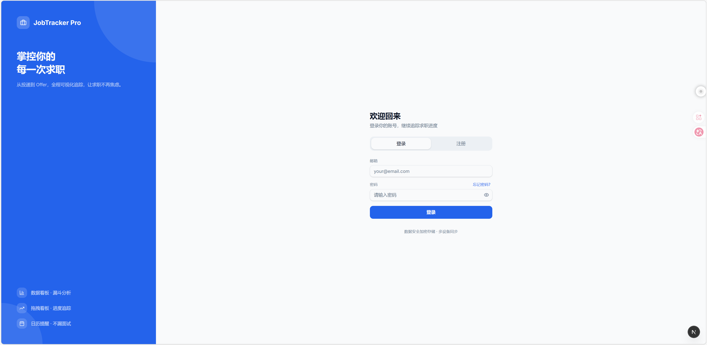
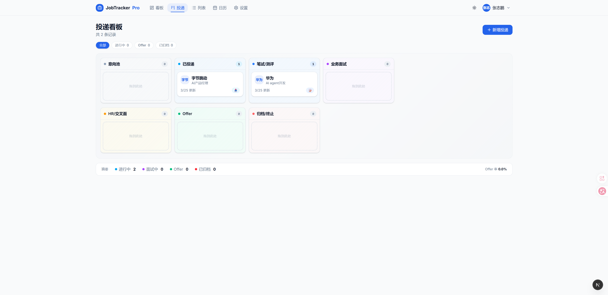
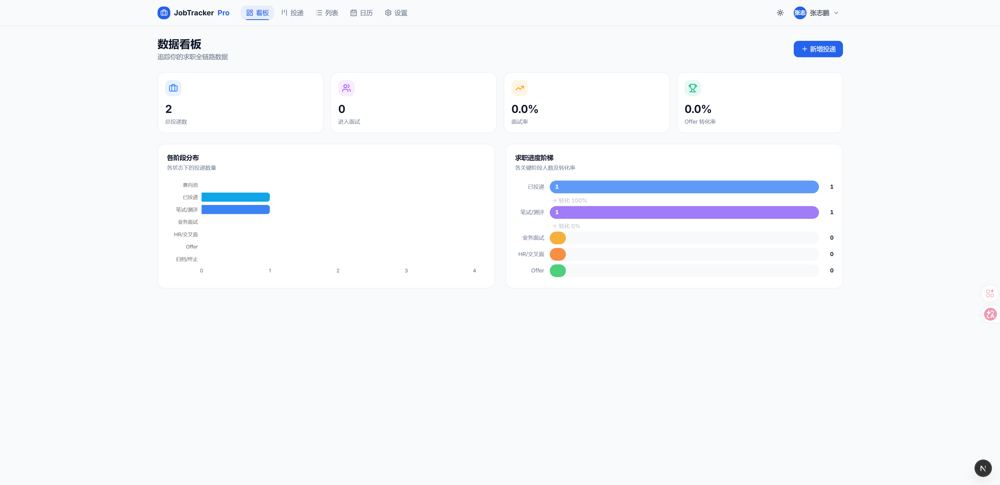
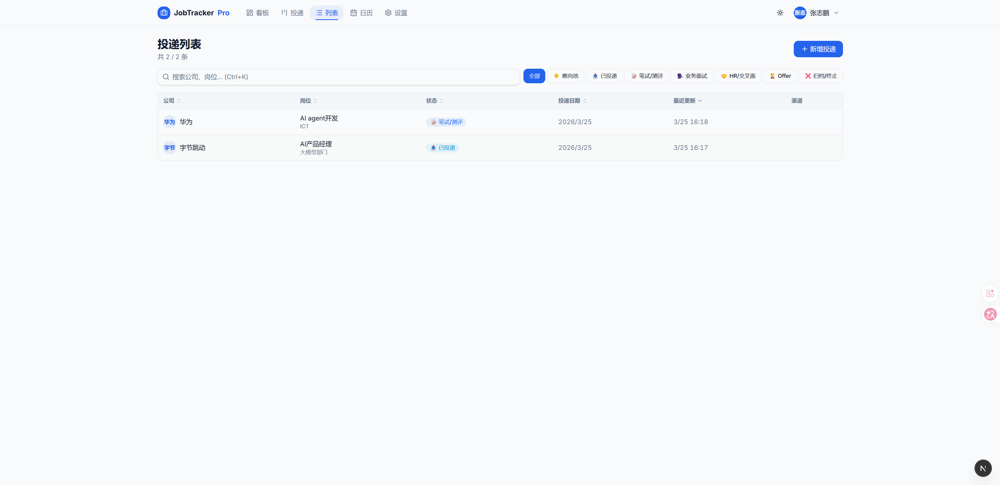
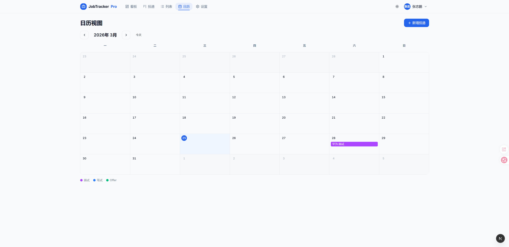
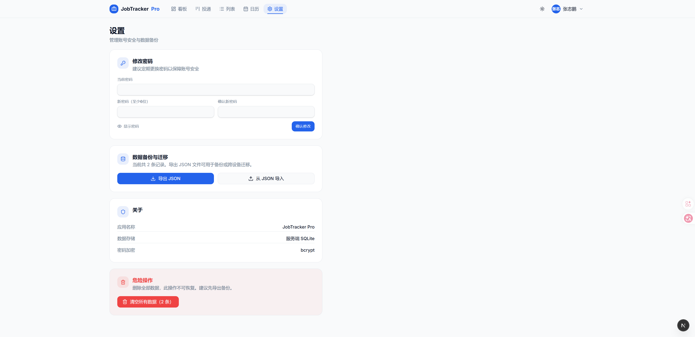

<div align="center">



# JobTracker Pro

**个人求职全链路追踪系统**

从投递到 Offer，全程可视化管理，让求职不再焦虑。

[](http://job.lifebytes.cn)


**[English Documentation](./README.md)**

</div>

---

## 📸 功能截图

### 数据看板


> 核心指标卡、求职进度阶梯图、未来 7 天面试提醒，一屏掌握全局。

### 拖拽看板


> 7 阶段敏捷看板，拖拽卡片即可更新状态，状态色彩语义清晰。

### 投递列表


> 全文搜索 + 多维排序 + 状态筛选，`Ctrl+K` 快捷唤起搜索框。

### 日历视图


> 月历展示所有面试安排，一目了然，不再错过任何面试。

### 设置页


> 修改密码、JSON 数据备份导出、一键清空。

---

## ✨ 核心功能

| 模块 | 功能描述 |
|------|----------|
| 📊 **数据看板** | 总投递数、面试率、Offer 率、进度阶梯图、7 天待办提醒 |
| 🗂 **拖拽看板** | 7 阶段看板（意向池→Offer），拖拽更新状态，状态色彩区分 |
| 📋 **投递列表** | 全文搜索、多维排序、状态筛选，支持 `Ctrl+K` 快捷搜索 |
| 📅 **日历视图** | 月历展示面试/笔试安排，点击事件直达详情 |
| 📝 **深度复盘** | 右侧滑出抽屉，Markdown 编辑器记录面试笔记 |
| 🕒 **流转时间轴** | 记录每个阶段的时间节点和事件备注 |
| 🔐 **多用户系统** | 注册/登录/找回密码，bcrypt 加密，JWT 鉴权 |
| 🌙 **暗色模式** | 明/暗主题一键切换，护眼夜间复盘 |
| 💾 **数据备份** | 一键导出/导入 JSON，数据永不丢失 |
| 🐳 **Docker 部署** | 开箱即用，宿主机代码热更新无需重启 |

---

## 🛠 技术栈

```
前端框架    Next.js 16 (App Router) + TypeScript
样式        Tailwind CSS v4
UI 组件     Radix UI Primitives（自建组件体系）
状态管理    Zustand
数据库      SQLite + Prisma ORM 7
认证        NextAuth.js v5 Beta
拖拽        @dnd-kit/core + @dnd-kit/sortable
图表        Recharts
Markdown    react-markdown + remark-gfm
主题        next-themes
容器化      Docker + Docker Compose
```

---

## 🚀 快速开始

### 本地开发

```bash
# 克隆项目
git clone https://github.com/P2hemia/Jobtracker-Pro.git
cd Jobtracker-Pro

# 安装依赖
npm install --legacy-peer-deps

# 配置环境变量
cp .env.example .env
# 编辑 .env，填写 NEXTAUTH_SECRET

# 初始化数据库
npx prisma db push

# 启动开发服务器
npm run dev
# 访问 http://localhost:3000
```

### 环境变量说明

```env
# 随机密钥，至少 32 位（生成命令：openssl rand -base64 32）
NEXTAUTH_SECRET=your-random-secret-here

# 应用访问地址
NEXTAUTH_URL=http://localhost:3000

# SQLite 数据库路径
DATABASE_URL=file:./prisma/dev.db
```

---

## 🐳 Docker 部署

### 1. 克隆 & 配置

```bash
git clone https://github.com/P2hemia/Jobtracker-Pro.git
cd Jobtracker-Pro

cp .env.example .env
nano .env
# 修改 NEXTAUTH_SECRET 和 NEXTAUTH_URL（改为你的服务器 IP 或域名）
```

### 2. 构建并启动

```bash
docker compose up -d --build
```

### 3. 初始化数据库（首次部署执行一次）

```bash
cat > /tmp/init_db.sh << 'EOF'
#!/bin/sh
apk add --no-cache sqlite
sqlite3 /data/dev.db "CREATE TABLE IF NOT EXISTS User (id TEXT PRIMARY KEY, email TEXT UNIQUE NOT NULL, name TEXT NOT NULL, password TEXT NOT NULL, createdAt DATETIME DEFAULT CURRENT_TIMESTAMP);"
sqlite3 /data/dev.db "CREATE TABLE IF NOT EXISTS Job (id TEXT PRIMARY KEY, userId TEXT NOT NULL, company TEXT NOT NULL, role TEXT NOT NULL, department TEXT, status TEXT DEFAULT 'applied', applyDate TEXT NOT NULL, jdLink TEXT, referrer TEXT, channel TEXT, reflections TEXT DEFAULT '', nextInterviewDate TEXT, events TEXT DEFAULT '[]', createdAt TEXT NOT NULL, updatedAt TEXT NOT NULL, FOREIGN KEY (userId) REFERENCES User(id) ON DELETE CASCADE);"
sqlite3 /data/dev.db "CREATE TABLE IF NOT EXISTS PasswordReset (id TEXT PRIMARY KEY, userId TEXT NOT NULL, token TEXT UNIQUE NOT NULL, expiresAt DATETIME NOT NULL, used INTEGER DEFAULT 0, createdAt DATETIME DEFAULT CURRENT_TIMESTAMP, FOREIGN KEY (userId) REFERENCES User(id) ON DELETE CASCADE);"
echo Done
EOF

docker compose cp /tmp/init_db.sh jobtracker:/tmp/init_db.sh
docker compose exec jobtracker sh /tmp/init_db.sh
```

### 4. 访问

打开 `http://你的IP或域名:3000`，注册账号即可使用。

### 宿主机热更新

`src/`、`public/`、`prisma/` 已通过 Docker Volume 挂载到容器内。
**在宿主机直接修改代码，无需重启容器，刷新浏览器即可生效。**

### 常用运维命令

```bash
# 查看实时日志
docker compose logs -f

# 重启容器
docker compose restart

# 停止
docker compose down

# 进入容器调试
docker compose exec jobtracker sh
```

---

## 📁 项目结构

```
jobtracker-pro/
├── src/
│   ├── app/
│   │   ├── page.tsx              # 数据看板
│   │   ├── kanban/               # 拖拽看板
│   │   ├── table/                # 投递列表
│   │   ├── calendar/             # 日历视图
│   │   ├── settings/             # 设置
│   │   ├── login/                # 登录/注册
│   │   ├── forgot-password/      # 找回密码
│   │   └── api/                  # 后端 API Routes
│   ├── components/
│   │   ├── ui/                   # 基础 UI 组件
│   │   ├── Navbar.tsx
│   │   ├── JobCard.tsx
│   │   ├── KanbanColumn.tsx
│   │   ├── JobDetailDrawer.tsx
│   │   └── AddJobDialog.tsx
│   ├── store/
│   │   └── useJobStore.ts        # Zustand 全局状态
│   ├── lib/
│   │   ├── prisma.ts
│   │   ├── auth.ts
│   │   └── utils.ts
│   └── types/
│       └── index.ts
├── prisma/
│   └── schema.prisma
├── png/                          # 截图资源
├── Dockerfile
├── docker-compose.yml
└── .env.example
```

---

## 🤝 贡献指南

欢迎提交 Issue 和 Pull Request！

1. Fork 本仓库
2. 创建分支：`git checkout -b feature/your-feature`
3. 提交：`git commit -m 'feat: add your feature'`
4. 推送：`git push origin feature/your-feature`
5. 提交 Pull Request

---

## 📄 License

[MIT](LICENSE) © 2026 [@P2hemia](https://github.com/P2hemia)
